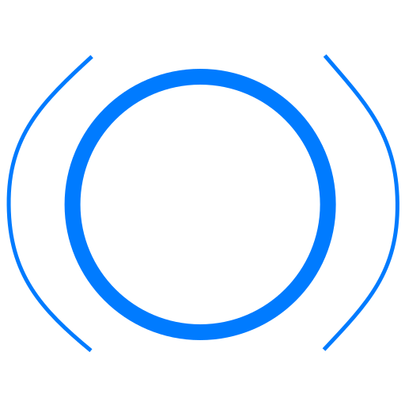

<p align="center">
  <a href="https://github.com/darkwood-com/navi">
    
  </a>
</p>

# Navi

Navi is a Personnal Assistant

It's a public architectural surface of a production system whose business core stays private.

This repository is not a sample app or a learning scaffold. It exists so the structural layer—how workflows are composed and executed—can be inspected, versioned, and evolved in the open while rules, scoring, integrations, and real workflow definitions remain on the private side.

The shape of the system:

- **Structured workflows** — execution proceeds as an ordered set of steps with an explicit `Context` and recorded `Event`s.
- **Composable execution** — each unit of work is an `Action`; the runner wires them without embedding domain meaning in the public names.
- **Maintainable boundaries** — Domain, Application, and Infrastructure stay separated so the private codebase can grow without collapsing this contract.

## What you will not find here

Business use cases, decision logic, matching or scoring, domain-specific naming beyond generic execution terms, connectors, or production workflow graphs. Those live with the private system.

## Layout

```text
src/
  Domain/Execution/
    Action.php              # contract for one step
    ActionName.php          # value object for step identity
    ActionResult.php        # context + emitted events from a step
    Context.php             # immutable bag carried through the run
    Event.php               # named record from a step
    ExecutionState.php      # context + completed steps + event log
  Application/Workflow/
    WorkflowRunner.php      # executes actions in sequence
    WorkflowResult.php      # wraps final execution state
  Infrastructure/Action/
    MergeContextAction.php  # structural action: merge payload into context
  Command/
    RunWorkflowCommand.php  # CLI entry that exercises the runner
tests/
  WorkflowRunnerTest.php
```

## Execution flow

Input: `Context`. The `WorkflowRunner` invokes each `Action` in order; each action returns `ActionResult` (updated context and optional `Event`s). Output: `WorkflowResult` wrapping the final `ExecutionState`.

## Run

```bash
composer install
composer test
php bin/console navi:workflow:run
```

The console command runs the same structural path as the test: two merge actions and JSON output of the resulting state. It is a smoke check for wiring, not a stand-in for real workflows.
